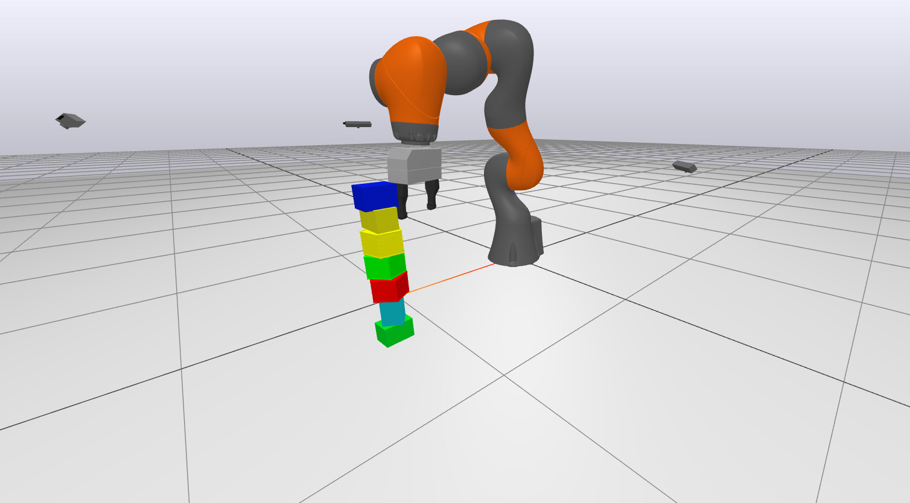

# stacking-robot
This is the [6.4210](manipulation.csail.mit.edu/) (Robotic Manipulation) final project of Kenneth Moon, Ani Rahul, and Ethan Yang.
The goal was to design and implement a full stack system that could stack right prisms.



## Development
Install [Drake](https://drake.mit.edu/) and [manipulation](https://github.com/RussTedrake/manipulation).
Using the included Dockerfile should directly work and may be simpler.

Run `main.py` to launch the simulation.

## Documentation

Here's a brief description of what the major files in our repository do.
- `main.py` is the most straightforward entrypoint to run our demo with a random seed. The number of prisms of each type can be specified through a command line argument.
- `setup_diagram.py` constructs the diagram for our system. 
- `/models` contains the models we used, such as the prisms.
### Perception
- `color_segmentation.py` is a system that takes in a point cloud and segments using DBSCAN. 
- `grasp_selector.py` is a system that takes in the segmented point clouds and outputs a pose of the gripper as the best grasp found.
- `grasping_utils.py` are utils forked from [manipulation](https://github.com/RussTedrake/manipulation) that contain our ranking system for candidate grasps.
- `merge_point_clouds.py` is a util system that merges point clouds from the multiple cameras.
- `label_image_to_point_cloud.py` is a system no longer in use, but it puts the label_image port from the [rgb sensors](https://drake.mit.edu/doxygen_cxx/classdrake_1_1systems_1_1sensors_1_1_rgbd_sensor.html) as the color in the point cloud. This enables perfect segmentation when it wasn't implemented yet.
### Planning
- `com_solver.py` defines a mathematical program to solve for the COM of the object the iiwa is holding based on external torques.
- `pick.py` are some utils, inspired by [manipulation](https://github.com/RussTedrake/manipulation), to create different trajectories from poses at different times.
- `stack_detector.py` is a system that outputs the highest point on the stack so we know where to place the next block.
- `stacking_planner.py` is a system that contains the state machine for our bot and communicates to the differential IK. 

### Evaluation
- `evaluate.py` runs the experiments for our report and produced in the `/logs` folder.
- `evaluation/monitor.py` is a system that determines when stacks are made, and could be the place where other stats are collected.


## Docker cmds

Docker command if you want to use jupyter notebook workflow and want to run `stacking.ipynb` (not tested extensively).
```
sudo docker build -t stacking .
sudo docker run -it -p 7000:7000 -p 8888:8888 stacking /bin/bash
cd workspace
jupyter notebook --ip 0.0.0.0 --port 8888 --no-browser --allow-root --NotebookApp.token='' --NotebookApp.password=''
```

## More
- View our (quickly made) final presentation on our project here: https://youtu.be/PU3fDTudHwg